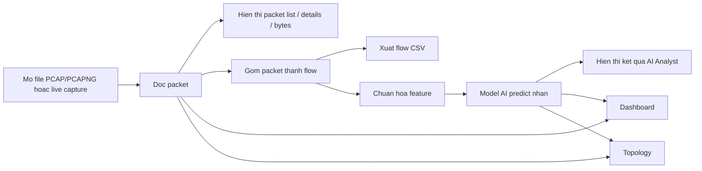

# DATN-Packetra

## 1. Giới thiệu

`DATN-Packetra` là một công cụ phân tích mạng có giao diện đồ họa, được xây dựng để phục vụ học tập, nghiên cứu, demo an toàn thông tin và hỗ trợ giải thích hành vi mạng theo cách trực quan hơn các công cụ chuyên sâu truyền thống. Dự án hướng tới nhóm người dùng là sinh viên, người mới học phân tích gói tin, người cần demo mạng trong môi trường học thuật, và người muốn kết hợp phân tích PCAP với pipeline AI phát hiện bất thường.

Điểm mạnh của project không chỉ nằm ở việc mở file `PCAP/PCAPNG`, mà còn ở việc kết nối nhiều lớp phân tích trong cùng một ứng dụng:

- Phân tích packet ở mức thấp.
- Gom packet thành flow để suy luận ở mức phiên giao tiếp.
- Xuất flow ra CSV để phục vụ nghiên cứu hoặc đưa vào mô hình AI.
- Hiển thị tổng quan qua dashboard và topology.
- Hỗ trợ demo packet theo tình huống.
- Hỗ trợ remote capture từ máy từ xa.
- Tích hợp AI Analyst để phân loại hành vi mạng và hỗ trợ diễn giải kết quả.

Nói ngắn gọn, Packetra cố gắng trả lời các câu hỏi kiểu:

- Máy A đang làm gì?
- Máy B đang giao tiếp với ai?
- Luồng nào là bình thường, luồng nào đáng nghi?
- Có tấn công hay không? Nếu có thì là loại nào?
- Có thể giải thích kết quả phân tích cho người mới một cách dễ hiểu hay không?

## 2. Mục tiêu của project

- Xây dựng một công cụ hỗ trợ phân tích mạng phục vụ học tập, nghiên cứu và demo an toàn thông tin.
- Làm cho việc đọc file capture và hiểu lưu lượng mạng dễ tiếp cận hơn Wireshark đối với người mới.
- Kết hợp được cả phân tích packet-level lẫn flow-level trong cùng một giao diện.
- Hỗ trợ pipeline chuyển đổi `PCAP -> Flow -> CSV -> AI Prediction`.
- Bổ sung trực quan hóa bằng dashboard và network topology.
- Hỗ trợ demo lưu lượng theo tình huống để dạy học và trình bày.
- Tạo nền tảng để phát triển thêm AI giải thích tự nhiên, dashboard nâng cao, remote capture ổn định hơn và đóng gói thành ứng dụng hoàn chỉnh.

## 3. Bài toán cần giải quyết

Trong thực tế, nhiều người mới gặp khó khăn khi học phân tích mạng vì:

- File PCAP rất nhiều packet, khó theo dõi bằng mắt.
- Các packet rời rạc không phản ánh rõ toàn bộ một phiên giao tiếp.
- Người mới thường biết “có traffic”, nhưng khó hiểu “traffic đó là gì”.
- Dữ liệu AI thường là flow-based, trong khi dữ liệu capture ban đầu lại là packet-based.
- Kết quả mô hình học máy dễ gây hiểu nhầm nếu không diễn giải đúng ngữ cảnh.

Packetra giải quyết bài toán đó bằng cách:

- Cho người dùng xem packet theo dạng bảng quen thuộc.
- Parse packet thành phần chi tiết để đọc từng protocol field.
- Gom packet thành flow để chuyển từ góc nhìn vi mô sang góc nhìn hành vi.
- Xuất flow ra CSV tương thích phong cách CIC/CICFlowMeter.
- Dùng mô hình AI để phân loại hành vi mạng.
- Hiển thị kết quả ở mức dashboard, topology và summary để dễ hiểu hơn.

## 4. Tính năng chính

### 4.1. Topology

- Hiển thị sơ đồ mạng từ capture hiện tại.
- Tạo các node đại diện cho host, endpoint hoặc địa chỉ mạng.
- Tạo edge thể hiện quan hệ giao tiếp giữa các host.
- Tóm tắt protocol, cổng và flow lines giữa hai đầu giao tiếp.
- Hỗ trợ quan sát trực quan “ai đang nói chuyện với ai”.

Topology đặc biệt hữu ích khi:

- Cần nhìn nhanh mạng có bao nhiêu host.
- Cần tìm host nói chuyện với nhiều host khác.
- Cần xem quan hệ giữa node, protocol và port.
- Cần mô tả một tình huống tấn công trong bài báo cáo hoặc demo.

### 4.2. Packet Analysis

- Đọc file `.pcap` và `.pcapng`.
- Hiển thị bảng packet với các cột chính như:

| Cột | Ý nghĩa |
| --- | --- |
| `No.` | Số thứ tự packet trong capture |
| `Time` | Thời điểm packet xuất hiện |
| `Source` | Địa chỉ nguồn |
| `Destination` | Địa chỉ đích |
| `Protocol` | Giao thức chính |
| `Length` | Độ dài packet |
| `Info` | Mô tả ngắn nội dung packet |

- Hiển thị vùng packet details dạng cây để xem từng field đã parse.
- Hiển thị vùng bytes/hex để xem dữ liệu thô.
- Hỗ trợ filter, search, follow stream, copy, comment, mark/unmark, ignore/unignore và nhiều thao tác ngữ cảnh khác.

### 4.3. Flow Analysis

- Gom nhiều packet thành flow bằng `core/flow_engine`.
- Mỗi flow đại diện cho một phiên hoặc một thực thể giao tiếp logic.
- Mỗi flow có thể chứa nhiều thuộc tính thống kê như:
  - IP nguồn, IP đích.
  - Port nguồn, port đích.
  - Protocol.
  - Timestamp bắt đầu.
  - Duration.
  - Tổng số packet forward/backward.
  - Tổng số byte forward/backward.
  - IAT, packet length statistics, flags, active/idle time, throughput.

Điểm rất quan trọng:

- Dataset như CIC-IDS-2017 là **flow-based**.
- Nghĩa là **mỗi dòng CSV là một flow**, không phải một packet đơn lẻ.

### 4.4. AI Detection / AI Analyst

- Tích hợp AI Analyst để phân tích lưu lượng theo hướng flow-based.
- Tạo flow từ packet đã chọn hoặc toàn bộ capture.
- Sinh bảng feature đầu vào cho model.
- Chuẩn hóa dữ liệu.
- Dự đoán nhãn hành vi mạng.
- Hiển thị:
  - Tổng số flow đã phân tích.
  - Tỷ lệ từng nhãn.
  - Các flow đáng chú ý.
  - Diễn giải ngắn kết quả phân tích.

### 4.5. Dashboard

- Hiển thị tổng quan lưu lượng bằng widget.
- Có hệ dashboard template và dashboard người dùng.
- Có thể tạo dashboard mới, đổi tên, chỉnh sửa, thêm widget, lưu, import và export.
- Có thể trực quan hóa các thống kê như:
  - Protocol distribution.
  - Endpoint activity.
  - Timeline analysis.
  - Top conversations.
  - HTTP/TLS analysis.
  - DNS analysis.
  - Security investigation.

### 4.6. Demo Packet

- Cung cấp bộ capture demo trong thư mục `demo/`.
- Cho phép chọn demo theo **tên action** thay vì chỉ theo mã số.
- Dùng để minh họa một tình huống mạng hoặc một kiểu hành vi/tấn công.
- Phù hợp cho:
  - Giảng dạy.
  - Demo đồ án.
  - Thử nghiệm dashboard/topology/AI nhanh mà không cần capture mới.

### 4.7. Remote Capture

- Hỗ trợ lấy lưu lượng từ máy từ xa.
- Có logic SSH remote capture cho Linux.
- Có remote agent cho Windows.
- Có giao diện quản lý interface/cấu hình remote trong GUI.

Các thành phần chính liên quan:

- `core/remote_capture.py`
- `core/capture.py`
- `agent/agent_service.py`
- `agent/build_agent_msi.py`
- `gui/manage_interfaces_dialog.py`

### 4.8. Help và tài liệu HTML

Project có bộ tài liệu HTML trong thư mục `help/`, ví dụ:

- `help/index.html`
- `help/user_guide.html`
- `help/capture_workflow.html`
- `help/capture_filter_guide.html`
- `help/filter_reference.html`
- `help/dashboard_guide.html`
- `help/agent_guide.html`

Đây là phần hướng dẫn thao tác trực tiếp cho người dùng cuối trong ứng dụng.

## 5. Kiến trúc tổng quan

Ở mức cao, Packetra có thể được hiểu qua 5 lớp:

1. **Input layer**
   - File `PCAP/PCAPNG`
   - Live capture local
   - Remote capture
   - Demo capture

2. **Parsing and inspection layer**
   - Parse packet
   - Hiển thị packet list
   - Hiển thị packet details
   - Hiển thị packet bytes

3. **Flow processing layer**
   - Gom packet thành flow
   - Tính feature
   - Xuất CSV
   - Chuẩn hóa theo schema tương thích CIC

4. **AI layer**
   - Nạp model
   - Chuẩn hóa feature
   - Predict nhãn
   - Sinh summary hành vi

5. **Visualization layer**
   - Dashboard
   - Topology
   - Statistics
   - AI Analyst summary

### 5.1. Workflow tổng quan



## 6. Cấu trúc thư mục

Project gốc nằm tại:

```text
D:\DATN-Packetra
```

### 6.1. Cấu trúc cấp cao

```text
DATN-Packetra/
|-- ai/
|-- agent/
|-- core/
|   |-- flow_engine/
|-- data/
|   |-- dashboard_templates/
|   `-- dashboards/
|-- demo/
|-- docs/
|-- gui/
|   `-- dashboard/
|-- help/
|   `-- examples/
|-- image/
|-- utils/
|-- main.py
|-- README.html
|-- README.md
`-- requirements.txt
```

### 6.2. Vai trò từng thư mục

| Thư mục / file | Vai trò |
| --- | --- |
| `ai/` | Chứa artifact AI đang dùng để inference |
| `agent/` | Remote capture agent, đặc biệt cho Windows |
| `core/` | Logic xử lý chính: capture, parse, filter, flow, remote capture |
| `core/flow_engine/` | Engine sinh flow, feature, CSV exporter, behavior analyzer, model adapter |
| `data/` | Dashboard templates và dashboard người dùng |
| `demo/` | Bộ file demo packet/capture |
| `docs/` | Tài liệu tham khảo, ghi chú train, tài liệu luận văn |
| `gui/` | Toàn bộ giao diện PySide6 |
| `gui/dashboard/` | Hệ dashboard builder, overview, editor, visualization |
| `help/` | Bộ tài liệu HTML cho người dùng |
| `image/` | Icon, hình minh họa và tài nguyên giao diện |
| `utils/` | Hàm tiện ích, IO, kiểm tra hệ thống, compile helper |
| `main.py` | Entry point GUI chính |
| `requirements.txt` | Dependency của project |
| `README.html` | Bản HTML hướng dẫn cài nhanh / sử dụng cơ bản |
| `README.md` | Tài liệu tổng quan và kỹ thuật của project |

### 6.3. Một số file mã nguồn quan trọng

| File | Vai trò |
| --- | --- |
| `main.py` | Khởi tạo ứng dụng, kiểm tra Npcap, mở cửa sổ chính |
| `gui/application.py` | Cửa sổ ứng dụng chính, menu, toolbar, dashboard, AI Analyst, statistics |
| `gui/capture_view.py` | Quản lý packet list, packet details, hex view, filter, trạng thái capture |
| `core/capture.py` | Sniffer local/remote |
| `core/parser.py` | Parse packet thành record có cấu trúc |
| `core/formatters.py` | Định dạng section/detail/info cho packet |
| `core/filtering.py` | Xử lý display filter |
| `core/remote_capture.py` | SSH remote capture |
| `core/flow_engine/feature_extractor.py` | Trích xuất flow và feature |
| `core/flow_engine/csv_exporter.py` | Xuất flow ra CSV |
| `core/flow_engine/model_adapter.py` | Nạp model AI và predict |
| `core/flow_engine/behavior_analyzer.py` | Tạo behavioral summary từ flow |
| `agent/agent_service.py` | Windows remote capture agent |
| `utils/system_check.py` | Kiểm tra Npcap và môi trường hệ thống |
| `utils/compile_project.py` | Compile nhanh toàn bộ project để rà lỗi cú pháp |

## 7. Giải thích các khái niệm cơ bản

### 7.1. Packet là gì?

Packet là đơn vị dữ liệu mạng nhỏ nhất mà công cụ nhìn thấy trực tiếp trong file capture hoặc trong live capture.

Ví dụ:

- Source: `192.168.1.10`
- Destination: `192.168.1.20`
- Protocol: `TCP`
- Destination Port: `80`

Đó chỉ là một gói tin đơn lẻ.

### 7.2. PCAP là gì?

`PCAP` hoặc `PCAPNG` là định dạng file dùng để lưu các packet capture. Đây là đầu vào gốc của công cụ.

### 7.3. Flow là gì?

Flow là một nhóm packet được gom lại thành một phiên giao tiếp logic hoặc một hướng lưu lượng có cùng đặc trưng giao tiếp.

Ví dụ:

- `192.168.1.10:51514 -> 192.168.1.20:80`
- Gồm 18 packet trong 1.8 giây
- Tổng 12 KB dữ liệu

Khi đó thay vì nhìn 18 packet rời rạc, người dùng có thể nhìn một flow duy nhất với thống kê đầy đủ.

### 7.4. CSV flow là gì?

CSV flow là file xuất ra sau khi packet được gom thành flow. Mỗi dòng CSV đại diện cho một flow và chứa các cột feature.

### 7.5. Dataset train AI là gì?

Đó là tập dữ liệu flow đã có nhãn sẵn. Mỗi dòng là một flow, có các cột feature và thường có thêm cột `Label`.

### 7.6. Label là gì?

Label là nhãn mục tiêu mà model học hoặc dự đoán, ví dụ:

- `Benign`
- `DDoS`
- `PortScan`
- `FTP-BruteForce`
- `Web Attack - SQL Injection`

### 7.7. Feature là gì?

Feature là các cột đầu vào cho mô hình AI, ví dụ:

- `Flow Duration`
- `Total Fwd Packets`
- `Flow Bytes/s`
- `SYN Flag Count`
- `Packet Length Mean`

### 7.8. Model AI là gì?

Model AI là mô hình học máy / học sâu được train để nhận đầu vào là feature của flow và sinh đầu ra là nhãn hành vi mạng.

### 7.9. Predict khác Train như thế nào?

| Khái niệm | Ý nghĩa |
| --- | --- |
| `Train` | Dùng dữ liệu đã có nhãn để học mô hình |
| `Predict` | Dùng dữ liệu mới chưa có nhãn để mô hình dự đoán nhãn |

Nói đơn giản:

- Train cần `feature + label`.
- Predict chỉ có `feature`.

## 8. Dataset và dữ liệu huấn luyện

### 8.1. Dataset chính

Theo định hướng học thuật của project, dataset nền tảng là **CIC-IDS-2017** và các tập dữ liệu flow đã được chọn lọc / chuẩn hóa theo schema kiểu CIC.

README này cần nhấn mạnh một lần nữa:

- Dữ liệu AI là **flow-based**.
- Mỗi dòng CSV là **một flow**.
- Không phải mỗi dòng là một packet.

### 8.2. Các nhãn cần quan tâm

Theo yêu cầu học thuật của project, các nhãn quan trọng gồm:

- `BENIGN` / `Benign`
- `Bot`
- `DDoS`
- `DoS GoldenEye`
- `DoS Hulk`
- `DoS Slowhttptest`
- `DoS slowloris`
- `FTP-Patator`
- `Heartbleed`
- `Infiltration`
- `PortScan`
- `SSH-Patator`
- `Web Attack Brute Force`
- `Web Attack SQL Injection`
- `Web Attack XSS`

### 8.3. Nhãn hiện đang có trong artifact của repo

Theo file `ai/model_info.json`, bộ model hiện đang đóng gói trong repo sử dụng 15 nhãn:

- `ARP_Spoofing`
- `Benign`
- `Bot`
- `Brute Force Attacks`
- `DDoS`
- `DoS Hulk`
- `DrDoS_DNS`
- `DrDoS_MSSQL`
- `FTP-BruteForce`
- `Infiltration`
- `Man-in-the-middle`
- `PortScan`
- `Web Attack - Brute Force`
- `Web Attack - SQL Injection`
- `Web Attack - XSS`

Điều này có nghĩa là:

- Về mặt nghiên cứu, project bám theo tư tưởng CIC-IDS-2017.
- Về mặt artifact hiện đang commit trong repo, model thực tế là một bản đã mở rộng / hợp nhất nhãn so với mô tả CIC-IDS-2017 thuần túy.

### 8.4. Tài liệu train tham chiếu

Tài liệu train hiện có tại:

- `docs/full train kaggle.md`

Từ metadata trong `ai/model_info.json`, pipeline train đã tham chiếu các file:

- `final_selected_15.csv`
- `merged_static_unit_aligned_6_labels.csv`

Điều đó cho thấy project hiện đang dùng một dataset đã được chọn lọc, merge và chuẩn hóa thêm cho mục tiêu train thực tế.

## 9. Mô hình AI

### 9.1. Trạng thái mô hình trong repo hiện tại

Đây là điểm rất quan trọng để tránh hiểu nhầm:

- Một số mô tả cũ của project có nhắc tới **XGBoost**.
- Tuy nhiên, mã nguồn và artifact hiện đang commit trong repo cho thấy phần inference thực tế đang dùng **FT-Transformer TorchScript chạy trên CPU**.

Dependency `xgboost` vẫn tồn tại trong `requirements.txt`, và `core/flow_engine/model_adapter.py` vẫn có khả năng nạp model `.json` của XGBoost, nhưng **bộ model đang có sẵn trong thư mục `ai/` không phải XGBoost**.

### 9.2. Artifact AI hiện có trong `ai/`

| File | Vai trò |
| --- | --- |
| `ai/ft_transformer_torchscript.pt` | Model TorchScript dùng để suy luận |
| `ai/standard_scaler.pkl` | StandardScaler để chuẩn hóa feature |
| `ai/label_encoder.pkl` | Giải mã chỉ số dự đoán thành tên nhãn |
| `ai/model_info.json` | Metadata mô tả model, feature count, class list và train info |

### 9.3. Ghi chú về artifact XGBoost được yêu cầu trong mô tả học thuật

Trong mô tả định hướng ban đầu, project có thể tồn tại biến thể artifact như:

- `ai/xgb_ids_model.json`
- `ai/label_encoder.pkl`
- `ai/feature_columns.json`

Ý nghĩa của chúng sẽ là:

- `xgb_ids_model.json`: model XGBoost đã train.
- `label_encoder.pkl`: mã hóa / giải mã nhãn.
- `feature_columns.json`: danh sách cột feature đúng thứ tự để đưa vào model.

Tuy nhiên, **repo hiện tại không chứa bộ file XGBoost đó**. Vì vậy README này mô tả theo hai lớp:

- **lý thuyết / định hướng học thuật**: XGBoost là một phương án hợp lý.
- **trạng thái thực tế của repo hiện tại**: inference đang chạy bằng FT-Transformer TorchScript.

### 9.4. Vì sao cần `feature_columns`

Trong mọi mô hình flow-based, thứ tự cột feature là cực kỳ quan trọng. Nếu feature không đúng thứ tự hoặc thiếu cột, model có thể dự đoán sai hoàn toàn.

Ở repo hiện tại:

- `model_info.json` vẫn nhắc tới `feature_columns_file`.
- Nhưng file `feature_columns.json` không có sẵn trong `ai/`.
- Thứ tự feature thực tế đang được ràng buộc bằng code trong `gui/application.py`.

### 9.5. Pipeline AI

Pipeline AI của Packetra có thể mô tả như sau:

1. Đọc PCAP.
2. Trích xuất packet.
3. Gom packet thành flow.
4. Sinh bảng feature.
5. Chuẩn hóa feature.
6. Sắp đúng thứ tự cột mà model yêu cầu.
7. Đưa vào model.
8. Dự đoán nhãn.
9. Hiển thị kết quả cho người dùng.

## 10. Pipeline xử lý PCAP -> Flow -> CSV -> AI Prediction

Đây là workflow kỹ thuật quan trọng nhất của project.

### 10.1. Bước 1: Đọc PCAP

Người dùng:

- mở file `.pcap` / `.pcapng`, hoặc
- capture trực tiếp, hoặc
- mở một file demo.

### 10.2. Bước 2: Parse packet

Hệ thống parse packet để sinh ra record có cấu trúc:

- protocol
- source/destination
- port
- info
- timestamp
- nội dung protocol chi tiết

### 10.3. Bước 3: Gom packet thành flow

`FlowFeatureExtractor` trong `core/flow_engine/feature_extractor.py` gom packet thành flow và tính thống kê flow.

### 10.4. Bước 4: Xuất CSV flow

Project có thể xuất ra:

- CSV nội bộ (`CSV_HEADER`)
- CSV tương thích CIC (`CIC_COMPAT_HEADER`)
- CSV legacy
- CSV source-style

Các logic này nằm trong:

- `core/flow_engine/csv_exporter.py`

### 10.5. Bước 5: Chuẩn hóa feature

Trước khi predict:

- dữ liệu được chuyển về số
- giá trị vô cực / NaN được xử lý
- scaler được áp dụng
- feature được sắp đúng thứ tự

### 10.6. Bước 6: Predict

`PacketraModelAdapter` sẽ:

- nạp model
- nạp scaler
- nạp label encoder
- chuyển dữ liệu về tensor hoặc input phù hợp
- suy luận nhãn

### 10.7. Bước 7: Hiển thị kết quả

Kết quả có thể được đưa vào:

- AI Analyst
- behavioral summary
- dashboard
- topology
- export CSV + thống kê

## 11. Dashboard và giao diện

### 11.1. Giao diện chính

Giao diện chính gồm các vùng quen thuộc của công cụ phân tích packet:

- Menu bar
- Toolbar
- Filter bar
- Packet list
- Packet details
- Packet bytes / hex view
- Status bar

### 11.2. Dashboard

Dashboard được xây dựng như một mô-đun riêng trong:

- `gui/dashboard/`

Project hỗ trợ:

- xem danh sách dashboard
- tạo dashboard
- import dashboard từ file JSON
- dùng template có sẵn
- thêm widget
- lưu dashboard người dùng

### 11.3. Dữ liệu dashboard

Dashboard hiện dùng:

- `data/dashboard_templates/` cho template
- `data/dashboards/user_dashboards.json` cho dữ liệu dashboard người dùng

### 11.4. Các template mẫu

Một số template hiện có:

- `template_network_overview.json`
- `template_protocol_analysis.json`
- `template_security_investigation.json`
- `template_timeline_analysis.json`
- `template_http_tls_analysis.json`
- `template_dns_analysis.json`
- `template_endpoint_activity.json`
- `template_topology_view.json`

### 11.5. Import dashboard

Project có hỗ trợ import dashboard. Nếu người dùng cần xem một file mẫu để tự tạo dashboard import, có thể tham khảo:

- `help/examples/sample_dashboard_import.json`

## 12. Topology mạng

Topology là tính năng trực quan hóa mạng ở mức host-to-host.

Nó giúp:

- gom quan hệ giao tiếp thành sơ đồ dễ nhìn
- hiển thị node và edge
- xem protocol nào đang đi trên mỗi liên kết
- nhìn nhanh host nào hoạt động bất thường

Ví dụ một quan sát topology:

- `192.168.1.10` giao tiếp với `192.168.1.20` qua `TCP/80`
- `192.168.1.10` cũng gửi nhiều kết nối ngắn tới nhiều port trên `192.168.1.30`
- từ đó có thể nghi ngờ `PortScan`

## 13. Demo Packet

### 13.1. Mục đích

Demo Packet được thiết kế để:

- minh họa hành vi mạng
- minh họa gói tin và flow theo action
- phục vụ dạy học, demo và kiểm thử nhanh

### 13.2. Cách hiểu

Khi người dùng chọn một action demo:

- ứng dụng sẽ mở capture tương ứng trong thư mục `demo/`
- tên action được ưu tiên hiển thị rõ ràng
- người dùng có thể xem packet list, flow, AI Analyst, dashboard và topology trên chính dữ liệu demo đó

### 13.3. Ví dụ diễn giải

- Một demo có thể cho thấy luồng bình thường và được AI dự đoán `Benign`.
- Một demo khác có thể cho thấy nhiều kết nối lặp lại và được dự đoán `PortScan`.
- Một demo khác có thể cho thấy lưu lượng dồn dập vào cùng một đích và được dự đoán `DDoS`.

## 14. Cài đặt môi trường

### 14.1. Yêu cầu

- Hệ điều hành: ưu tiên Windows cho local capture.
- Python: nên dùng Python `3.11`.
- Npcap: cần nếu muốn capture trực tiếp trên Windows.

### 14.2. Clone hoặc mở project

Nếu đã có mã nguồn:

```powershell
cd D:\DATN-Packetra
```

### 14.3. Tạo virtual environment

PowerShell:

```powershell
python -m venv .venv
.venv\Scripts\Activate.ps1
```

CMD:

```cmd
python -m venv .venv
.venv\Scripts\activate.bat
```

### 14.4. Cài thư viện

```powershell
pip install -r requirements.txt
```

### 14.5. Nếu chưa có `requirements.txt`

Repo hiện tại **đã có** `requirements.txt`, nên người dùng mới không cần tự tạo. Nếu sau này project phát sinh dependency mới, hãy cập nhật file này thay vì cài thủ công rồi quên ghi lại.

### 14.6. Dependency chính hiện tại

Theo `requirements.txt`, các thư viện chính gồm:

- `scapy`
- `PySide6`
- `psutil`
- `lz4`
- `paramiko`
- `pywin32`
- `numpy`
- `xgboost`
- `scikit-learn`
- `joblib`
- `torch` CPU wheel

### 14.7. Npcap

`main.py` sẽ kiểm tra Npcap trên Windows khi khởi động. Nếu chưa có, ứng dụng sẽ cảnh báo người dùng.

Trang chủ:

```text
https://npcap.com/
```

## 15. Cách chạy project

### 15.1. Chạy GUI

Entrypoint chính hiện tại là:

```powershell
python main.py
```

### 15.2. Chạy kiểm tra compile toàn project

```powershell
python utils\compile_project.py
```

### 15.3. Các luồng sử dụng phổ biến trong GUI

1. Mở file `PCAP/PCAPNG`.
2. Hoặc chọn interface để capture trực tiếp.
3. Áp dụng display filter nếu cần.
4. Xem packet list, packet details và bytes.
5. Mở AI Analyst để phân tích flow.
6. Export flow CSV nếu cần nghiên cứu hoặc lưu lại.
7. Mở Dashboard hoặc Topology để xem trực quan hóa.

### 15.4. Chạy module phân tích PCAP

Hiện tại project không tách một CLI độc lập kiểu `analyze_pcap.py` ở root. Luồng phân tích PCAP chủ yếu đi qua GUI. Nếu sau này bạn thêm script riêng, hãy cập nhật README theo đúng tên file thực tế trong project.

### 15.5. Chạy predict AI

Hiện tại predict AI cũng chủ yếu được tích hợp trong GUI thông qua:

- AI Analyst
- export flow + behavioral summary

Repo chưa cung cấp một lệnh CLI predictor chuẩn hóa riêng ở root. Nếu bạn muốn tách riêng sau này, nên dùng dạng:

```powershell
python <ten_file_predict_thuc_te>.py --input <flow_csv>
```

Lưu ý: cần thay bằng tên file thực tế trong project nếu bạn bổ sung CLI predictor sau này.

### 15.6. Remote capture

Remote capture hiện được tích hợp trong GUI và logic backend. Với Linux, hệ thống SSH đến máy từ xa và gọi `tcpdump -D` hoặc `tcpdump -w -`. Với Windows, project dùng remote agent trong thư mục `agent/`.

## 16. Cách train model

### 16.1. Trạng thái hiện tại

Repo hiện tại **không chứa một script `train.py` duy nhất, hoàn chỉnh, đặt sẵn ở root để chạy ngay**. Phần train đang được phản ánh qua:

- `docs/full train kaggle.md`
- `ai/model_info.json`
- artifact đã export trong `ai/`

Vì vậy, cách mô tả đúng nhất là:

- pipeline train đã được thực hiện trong môi trường nghiên cứu / Kaggle
- kết quả inference đã được đóng gói mang về repo

### 16.2. Cách hiểu pipeline train từ tài liệu hiện có

Theo `docs/full train kaggle.md`, quá trình train gồm các bước chính:

1. Chuẩn bị dataset flow.
2. Làm sạch và chuẩn hóa nhãn.
3. Chọn các cột feature.
4. Cân bằng dữ liệu hoặc kiểm soát quota theo nhãn.
5. Chia train/validation/test.
6. Chuẩn hóa feature bằng scaler.
7. Huấn luyện model.
8. Đánh giá bằng accuracy, macro F1 và confusion matrix.
9. Export model cùng scaler, label encoder và metadata.

### 16.3. Output train kỳ vọng

Với pipeline train kiểu này, output thường gồm:

- model đã train
- scaler
- label encoder
- danh sách feature columns
- metadata model
- báo cáo đánh giá

Trong repo hiện tại, output inference đang dùng thực tế là:

- `ai/ft_transformer_torchscript.pt`
- `ai/standard_scaler.pkl`
- `ai/label_encoder.pkl`
- `ai/model_info.json`

### 16.4. Ghi chú về XGBoost

Nếu bạn tiếp tục phát triển nhánh XGBoost như mô tả học thuật ban đầu, bộ output phù hợp sẽ là:

- `ai/xgb_ids_model.json`
- `ai/label_encoder.pkl`
- `ai/feature_columns.json`

Nhưng đó là **bộ artifact mong muốn của biến thể XGBoost**, không phải trạng thái artifact đang commit hiện tại.

## 17. Cách predict với model đã train

### 17.1. Luồng predict trong ứng dụng

Trong repo hiện tại, predict được thực hiện theo luồng:

1. Mở file capture hoặc chọn packet cần phân tích.
2. Dùng flow extractor để tạo flow.
3. Chuyển flow thành feature rows.
4. Chuẩn hóa dữ liệu bằng `standard_scaler.pkl`.
5. Nạp model từ `ai/ft_transformer_torchscript.pt`.
6. Dự đoán nhãn.
7. Giải mã nhãn bằng `label_encoder.pkl`.
8. Hiển thị kết quả trong AI Analyst.

### 17.2. Khi predict dữ liệu thực tế

CSV đầu vào cho predict:

- không cần cột `Label`
- phải có đúng schema feature mà model mong đợi
- phải đúng thứ tự cột
- phải tương thích với scaler và preprocessing của lúc train

### 17.3. Nếu dùng model khác

Nếu bạn thay model hiện tại bằng model XGBoost hoặc model khác:

- cần giữ nguyên thứ tự feature
- cần cập nhật lại model adapter nếu cần
- cần đảm bảo flow schema tương thích

## 18. Kết quả hiện tại

### 18.1. Kết quả train tham chiếu

Theo yêu cầu học thuật của project, phần kết quả hiện tại nên ghi nhận các chỉ số tham chiếu sau:

| Chỉ số | Giá trị tham chiếu |
| --- | --- |
| Validation Accuracy | `~0.998999` |
| Validation Macro F1 | `~0.896475` |
| Test Accuracy | `~0.998971` |
| Test Macro F1 | `~0.880355` |

### 18.2. Cách diễn giải

- Accuracy rất cao vì dữ liệu có nhiều lớp phổ biến và nhiều flow dễ phân biệt.
- Macro F1 thấp hơn accuracy vì một số lớp hiếm hoặc khó như web attack, MITM, brute-force hoặc các lớp bị chồng lấn sẽ khó học hơn.
- Vì vậy không nên chỉ nhìn accuracy rồi kết luận model “đã hoàn hảo”.

### 18.3. Kết luận thận trọng

Model hiện tại cho thấy tiềm năng tốt trong môi trường nghiên cứu, nhưng vẫn cần:

- đánh giá thêm trên dữ liệu thực tế
- đánh giá thêm trên traffic khác môi trường train
- tiếp tục cải thiện các lớp ít dữ liệu hoặc dễ nhầm lẫn

## 19. Hạn chế

- Model hiện phụ thuộc mạnh vào dữ liệu kiểu CIC-style flow.
- Feature phải đúng schema và đúng thứ tự như lúc train.
- Repo hiện tại chưa chứa một pipeline train tái lập hoàn chỉnh chỉ bằng một lệnh.
- File `feature_columns.json` không có sẵn trong `ai/` dù `model_info.json` vẫn tham chiếu đến nó.
- Mô hình hiện tại vẫn cần kiểm chứng thêm trên dữ liệu thực tế ngoài môi trường train.
- Các lớp ít dữ liệu hoặc chồng lấn hành vi có thể dự đoán chưa ổn định.
- Nếu tự viết `PacketraFlowEngine` hoặc thay đổi logic sinh feature, model hiện tại có thể không còn tương thích.
- Nếu CSV đầu ra khác format CIC/CICFlowMeter hoặc khác schema lúc train, có thể phải train lại model.
- Công cụ chưa thể thay thế hoàn toàn Wireshark, IDS chuyên nghiệp hoặc nền tảng SOC thương mại.

## 20. Định hướng phát triển

- Hoàn thiện `PacketraFlowEngine` hơn nữa và chuẩn hóa tài liệu schema flow.
- Tách pipeline train thành script rõ ràng, tái lập được ngay trong repo.
- Tích hợp CICFlowMeter tốt hơn hoặc tạo bộ exporter/adapter chuẩn hơn.
- Hỗ trợ chọn một phần packet trong PCAP để convert thành flow đầy đủ hơn.
- Tối ưu dashboard cho capture lớn và bố cục trực quan hơn.
- Bổ sung giải thích AI prediction bằng ngôn ngữ tự nhiên.
- Bổ sung thêm dataset ngoài CIC-IDS-2017 để tăng khả năng tổng quát hóa.
- Bổ sung nhiều PCAP mẫu hơn cho từng loại tấn công.
- Cải thiện xử lý class imbalance.
- Đóng gói thành ứng dụng dễ cài đặt cho người mới.

## 21. Câu hỏi thường gặp

### 21.1. Project này phân tích packet hay flow?

Cả hai. Packet là dữ liệu gốc để hiển thị và kiểm tra chi tiết. Flow là lớp trung gian để phân tích hành vi và đưa vào AI.

### 21.2. Vì sao AI không dự đoán trực tiếp từng packet?

Vì các dataset IDS phổ biến như CIC thường ở dạng flow-based. Một packet đơn lẻ thường không đủ ngữ cảnh để kết luận hành vi mạng.

### 21.3. Mỗi dòng CSV là một packet hay một flow?

Trong pipeline AI của project, mỗi dòng CSV là **một flow**.

### 21.4. Project có dùng CICFlowMeter không?

Project có định hướng tương thích CICFlowMeter và có tham chiếu rõ tới schema CIC. Đồng thời project cũng có custom flow engine riêng trong `core/flow_engine/`.

### 21.5. Project hiện đang dùng XGBoost hay FT-Transformer?

Artifact hiện đang commit trong repo là **FT-Transformer TorchScript**. Tuy nhiên code model adapter vẫn có nhánh hỗ trợ XGBoost nếu sau này bạn muốn dùng lại.

### 21.6. Tôi có thể chạy project chỉ để xem packet mà không dùng AI không?

Có. Packetra vẫn hữu ích như một công cụ xem và phân tích packet ngay cả khi chưa dùng AI Analyst.

### 21.7. Tôi có thể dùng dữ liệu mới để predict không?

Có, nhưng dữ liệu phải được chuyển thành flow feature đúng schema mà model yêu cầu.

### 21.8. Remote capture có bắt buộc không?

Không. Đây là tính năng bổ sung. Người dùng có thể chỉ mở file PCAP hoặc capture local trên Windows.

## 22. Kết luận

`DATN-Packetra` là một project phân tích mạng theo hướng học thuật nhưng có tính ứng dụng rõ ràng. Điểm cốt lõi của project là kết nối được toàn bộ chuỗi:

- đọc packet
- hiểu packet
- gom thành flow
- xuất CSV
- đưa vào AI
- hiển thị kết quả một cách trực quan

Nếu người mới đọc README này, mục tiêu là phải hiểu được:

- project dùng để làm gì
- luồng xử lý dữ liệu ra sao
- packet khác flow như thế nào
- AI dùng dữ liệu gì và suy luận ở mức nào
- cần cài gì để chạy
- entrypoint hiện tại là gì
- hạn chế hiện tại nằm ở đâu
- và nên phát triển tiếp theo hướng nào

Đó chính là mục tiêu của tài liệu này.
